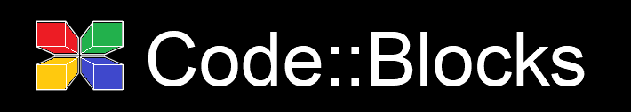
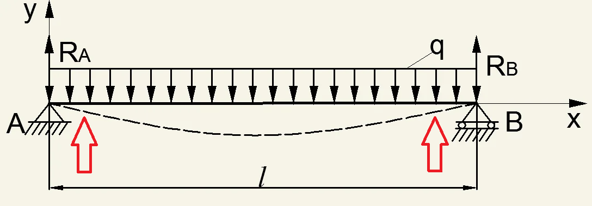

# Консольное приложение для определения эквивалентной нагрузки на балку.

### Цель разработки: 
определение эквивалентной равномерно распределенной нагрузки от разных видов нагружений на балку с шарнирным опиранием. Критерием перевода 
служит изгибающий момент.

### Рассмотрены следующие варианты приложения внешней нагрузки:: 
- Сосредоточенная нагрузка в середине пролета балки;
- Сосредоточенная нагрузка в произвольном месте балки;

(<a href="#readme-top">back to top</a>)

