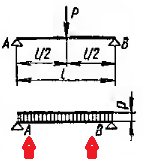
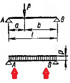
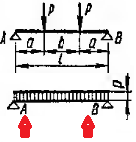

# Консольное приложение для определения эквивалентной нагрузки на балку.

### Цель разработки: 
определение эквивалентной равномерно распределенной нагрузки от разных видов нагружений на балку с шарнирным опиранием. Критерием перевода служат изгибающие моменты, поперечные силы и опорные
реакции.

### Рассмотрены следующие варианты приложения внешней нагрузки:: 
<!-- TABLE OF CONTENTS -->

  
Сосредоточенная нагрузка в середине пролета балки;

  <ol align="center">
    
  </ol>

<!-- TABLE OF CONTENTS -->

  
Сосредоточенная нагрузка в произвольном месте балки;

  <ol align="center">
    
  </ol>

<!-- TABLE OF CONTENTS -->

  
Две равные по значению симметрично расположенные сосредоточенные нагрузки;

  <ol align="center">
    
  </ol>

(<a href="#readme-top">back to top</a>)

